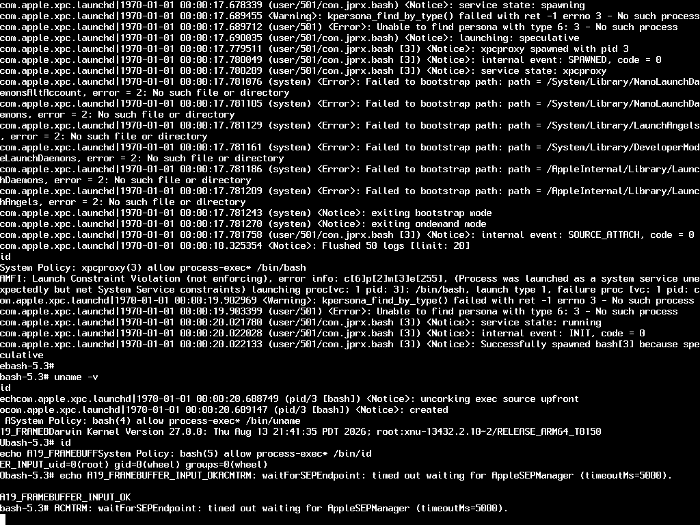

# A19 / iOS 27 graphics investigation

Goal: a usable graphical A19/iOS 27 guest. This experiment establishes a boot
framebuffer and UART input path; SpringBoard, touch/HID, accelerated graphics,
and a full installed system are not working yet.

## Current checkpoint

- The full iOS shared cache maps using the documented diagnostic owner-check patch.
- Backboardd starts under launchd with its original mobile identity and MachServices.
- Notifyd and both preference daemons start through normal boot registration.
- HID, render, notification and preference Mach-port lookups succeed.
- `IOSurfaceRoot` is registered, but no GPU attachment or rendered UI is verified.
- LLDB works through QEMU; a temporary TXM state override enables guest task inspection.
- Thread samples put the display client in CASGetDisplays/Mach receive and
  backboardd in AppleKeyStore connection setup during Biome initialization.
- SpringBoard and graphical interaction remain unfinished.

## Verified milestone (2026-09-17)

iPhone18,3, iOS 27.0 build 24A437, kernel
`xnu-13432.2.10~2/RELEASE_ARM64_T8150` booted to Bash with text rendered by the
guest kernel into a 1024x768 framebuffer. Commands entered through the emulated
UART executed in the guest and their output appeared on screen:

- `uname -v`: the T8150 kernel above.
- `id`: `uid=0(root) gid=0(wheel)`.
- `echo A19_FRAMEBUFFER_INPUT_OK`: marker visible on screen.



This is actual guest framebuffer output. The host only copies guest physical
memory into a QEMU display surface. No host-generated text or pattern was used.
The image is a QMP screendump, not evidence of SpringBoard or a GPU driver.

## Reproduce

Use the prepared firmware from SETUP-NOTES.md, including its ownership fix.
Apply this experimental patch to qemu-sptm commit
`2867d847d3471560e773120ee50c42dbcbb6d60b`:

```sh
git submodule update --init
git -C qemu-sptm apply ../research/boot-display.patch
mkdir -p qemu-sptm/build
cd qemu-sptm/build
../configure --target-list=aarch64-softmmu --disable-pvg
make -j8
cd ../..
mkdir -p logs
FIRMWARE_DIR=/absolute/path/to/firmware/iphone-17 \
  SERIAL='unix:/tmp/a19-display-serial.sock,server=on,wait=off' \
  ./research/run-boot-display.sh > logs/boot-display.log 2>&1
```

In another terminal after the guest boots:

```sh
python3 research/send-serial.py /tmp/a19-display-serial.sock 'uname -v'
python3 research/send-serial.py /tmp/a19-display-serial.sock 'id'
python3 research/qmp.py /tmp/a19-display-qmp.sock screendump \
  '{"filename":"/tmp/a19-screen.ppm"}'
```

Allow commands to finish before capturing. The tested boot takes tens of
seconds on this host; elapsed time alone does not prove a shell is ready.
Repeated SEP timeout messages can scroll the results away. `DISPLAY_BACKEND`
defaults to `none`; a GUI frontend such as `cocoa` can be selected in a build
that supports it, but this experiment verified QMP screenshots only. QEMU GUI
keyboard/mouse input is not connected to an iOS HID device. Use UART input.

Stop this experimental VM with:

```sh
python3 research/qmp.py /tmp/a19-display-qmp.sock quit
```

Use distinct QMP and serial socket paths for simultaneous instances. The
standard launchers retain their original behavior; the display is opt-in via
`-M darwin,boot-display=on`.

## Findings and experiments

1. Upstream leaves `boot_args.Video` zeroed. The prototype supplies a physical
   address, 4096-byte stride, 1024x768 dimensions, and 32-bit pixel depth.
2. Simply extending `topOfKernelData` to reserve the framebuffer fails before
   XNU serial output. QMP inspection of SPTM's guest stack recovered:
   `Frame has been left untyped during bootstrap 0x0000010015f84000`.
   The display stayed black. The CPU was still running in EL2, so lack of serial
   output did not mean QEMU itself had exited.
3. The current prototype pads the end of the RAMDisk memory-map range with
   3 MiB for the framebuffer. SPTM then covers these pages with a known range,
   and the same restore filesystem still boots. **This is an experimental
   reservation workaround, not a final framebuffer memory design.** It changes
   the guest ramdisk's reported size. The source DMG is never modified.
4. `serial=3` keeps output on UART; the video surface has essentially only its
   initial cursor. `serial=0` sends console output to the screen. `serial=2`
   additionally enables UART input while leaving screen output selected.
   This follows XNU's `SERIALMODE_OUTPUT=1` / `SERIALMODE_INPUT=2` definitions.
5. Serial input is paced (40 ms per byte) to avoid overflowing the emulated
   UART FIFO. Kernel/service logs interleave with typed commands.

The framebuffer is an early console only: no emulated display controller,
IOGPU user client, Metal, touch device, or normal system-volume boot has been
implemented. The code uses full-frame copies on display updates, a fixed size,
and only the SPTM loader. Reset/migration and other devices are unverified.

## Next investigation

The exact kernel collection has 319 kext entries, including `com.apple.AGXG18P`
(360.34.5a1), `AGXFirmwareKextG18PRTBuddy`, `EXDisplayPipeH18P`, `IOGPUFamily`,
`IOSurface`, and Apple HID/multitouch drivers. Their presence in the collection
does not mean they attach to the deliberately stripped device tree.

The full filesystem image from the same IPSW was extracted locally to
inspect SpringBoard, backboardd, and their launch/service dependencies:

```sh
ipsw extract --remote \
  'https://updates.cdn-apple.com/2026FallFCS/b18c9502-c21d-4555-9bf7-21f3a238e6d7/iPhone18,3_27.0_24A437_Restore.ipsw' \
  --dmg fs --output ipsw_db/iphone-17-full --flat --json
```

The system filesystem does not contain the dyld shared cache. That is in the
separate `Cryptex1,SystemOS` image, `043-69319-704.dmg.aea`, selected by the
same build manifest (`ipsw extract --dmg sys`). Its main cache and subcaches
must accompany the UI executables. The probe copies the decrypted cryptex to
`/System/Cryptexes/OS` and creates the conventional cache-directory symlink.
Neither SpringBoard nor backboardd has reached a working UI.

### Larger userspace probe

A disposable 8 GiB APFS image was created from the original restore ramdisk
using `hdiutil create -size 8g -fs 'Case-sensitive APFS' -layout NONE
-volname a19-ui-probe -srcfolder /tmp/a19-restore -srcowners on -anyowners
-format UDRW ...`. This preserves the existing root-owned launch configuration.
The protected `private/etc/master.passwd` required a separate copy with source
ownership disabled. The system cryptex, backboardd, SpringBoard.app, and ioreg
were then copied into this image. This is a diagnostic ramdisk, not a normal
iOS system/data-volume installation.

The first boot exposed a size truncation: APFS saw only the extra 3 MiB
framebuffer padding, rather than the 8 GiB image plus padding. XNU's memdev
block-count and block-strategy code shifted a 32-bit page count before
widening it. `patch-memdev-block-size.py` changes four instructions in the exact
24A437/T8150 kernel collection to perform those operations with 64-bit values.
The script checks the entire input SHA-256 and each original instruction,
writes a new file, and refuses to overwrite an existing destination. It does
**not** fix raw character I/O or core-dump range reporting. This is an
experimental block-device workaround, not a general memdev patch.

With that kernel, APFS reported 16,783,360 512-byte device blocks, mounted the
8 GiB volume, and reached a verified root Bash shell. Patch hashes and offsets
are recorded in [memdev-patch.json](evidence/memdev-patch.json).

The guest needs 16 GiB configured in both QEMU and the device tree.
`set-guest-memory.py` modifies only the existing `dram-size` property. A full
round trip through dt_fixup is unsafe here: its string heuristic adds a NUL
to the already-patched all-`A` random-seed, changing 256 bytes to 257 and
causing an early SPTM panic.

The probe trust cache merges the baseline hashes with those from the system
and cryptex trust caches (4,372 unique SHA-256 CDHashes). The current generator
emits version 1 and discards version 2 constraint metadata; this is a research
limitation. Firmware and Apple's binaries remain local and untracked.

In the first full probe, dyld could not map the shared cache. ioreg and
backboardd exited 134, reporting missing libraries that should come from that
cache. Starting SpringBoard produced repeated TXM errors (`selector: 38 | 42`)
and the experiment was stopped. Cache ownership and mapping must be resolved
before interpreting these failures as graphics-driver requirements.

The writable-remount experiment failed: mount_apfs returned "Operation not
permitted" (77), and chown failed because the guest root stayed read-only.
A subsequent guest stat reported the cache owner as `99:99`, not root.
The read/write host mount with ownership disabled also refused chown to root.
See [probe excerpts](evidence/ui-probe-excerpts.txt).

`cache-diagnostics.c` enables `vm.shared_region_trace_level=4`, verified from
its previous value of 1. No extra shared-region diagnostics appeared on UART;
reading `kern.msgbuf` returned only a few bytes, not a usable log. It can be
built without the iPhone SDK by declaring the few libSystem functions used:

```sh
xcrun clang -target arm64-apple-ios27.0 -isysroot /tmp/a19-restore \
  -nostdlib research/cache-diagnostics.c \
  /tmp/a19-restore/usr/lib/libSystem.B.dylib -o /tmp/cache-diagnostics
codesign -s - /tmp/cache-diagnostics
```

Copy the executable into the probe's `/bin`, add its CDHash to `all_hashes`,
and regenerate the guest trust cache before booting. Only firmware/tool hashes
are included; no Apple binaries are committed.

`ui-probe.sh` runs this diagnostic, reports ownership, and tries ioreg/backboardd;
SpringBoard is omitted until those prerequisites work. `run-serial-probe.py` waits for the Bash prompt,
sends the probe with paced UART input, and records a transcript. A timeout
leaves the VM alive for inspection; it is not evidence that the VM stopped.

[Device inventory](evidence/display-device-inventory.json) compares the original
and patched matching properties: DCP, EXDisplayPipe and related devices lose
driver matching, and the GPU node is removed. The kernel collection contains
relevant drivers, but they cannot be assumed to attach. The cache-mapping experiment and subsequent service investigation are recorded
below.

A separate diagnostic kernel (`patch-cache-owner-check.py`) changes only the
conditional branch rejecting a nonzero `va_uid` to NOP, on top of the verified
memdev patch. It is pinned to that exact input hash. This deliberately weakens
the experimental guest's shared-cache admission and must be replaced by proper
image ownership for a maintained implementation. It tests whether the known
metadata mismatch explains the loading failure; it does not disable the other
mapping checks. [Patch record](evidence/cache-owner-patch.json).

## Sources

- [XNU boot video initialization](https://github.com/apple-oss-distributions/xnu/blob/main/pexpert/arm/pe_init.c)
- [XNU video console](https://github.com/apple-oss-distributions/xnu/blob/main/osfmk/console/video_console.c)
- [XNU serial mode definitions](https://github.com/apple-oss-distributions/xnu/blob/main/osfmk/console/serial_protos.h)

These public sources informed the experiments; the actual behavior above was
verified on the requested iOS 27 guest. Local logs and firmware stay untracked.


### Shared cache mapped; backboardd reaches service initialization

The controlled owner-check experiment succeeded: launchd's dyld printed
`dyld cache mapped system-wide: customer, auth GOTs: unmapped`. No
"syscall to map cache into shared region failed" messages appeared in that
boot, ioreg exited 0, and backboardd advanced into service initialization.
The IOAccelerator query returned no devices, so exit 0 does not establish a
working GPU. The guest still reported owner `99:99`; the single branch patch,
not a metadata correction, enabled this result.

Backboardd then requested missing notification, preference, RunningBoard,
MobileGestalt, and other services. Its shell launch entered a user/501
bootstrap context despite uid 0, and the sandbox denied registration of
`com.apple.iohideventsystem`. It also spawned ACCHWComponentAuthService through
XPC. This is evidence of executing UI-service code, not of a working compositor.
The next controlled test should use launchd with the real MachServices
registration and appropriate service dependencies. The source backboardd plist
also declares a `_Conclave`; the restore launchd reports that it skips
`init-exclavekit`, so that path remains an explicit unknown.

Reproduce the latest probe after preparing the local image/trust cache:

```sh
FIRMWARE_DIR=firmware/iphone-17-ui-probe \
RAMDISK=firmware/iphone-17-ui-probe/ui-root.dmg \
BOOTKC=firmware/iphone-17-ui-probe/bootkc-cache-owner-probe MEMORY=16G \
QMP_SOCKET=/tmp/a19-ui-qmp.sock \
SERIAL='unix:/tmp/a19-ui-serial.sock,server=on,wait=on' \
BOOT_ARGS='rd=md0 serial=3 -v -noprogress wdt=-1 wlan-olyhal-abort' \
./research/run-boot-display.sh

# Second terminal; transcript path must not already exist:
python3 research/run-serial-probe.py /tmp/a19-ui-serial.sock \
  logs/ui-probe-client.log --timeout 240
```

`wait=on` ensures that early UART boot output is collected. A long-lived service
may outlast the collector deadline; query QMP status and inspect the transcript
before deciding whether to stop the experiment.

The v7 probe was stopped through QMP after collecting these service failures.
Its timeout wrapper had not returned, so no backboardd exit status or complete
UI_PROBE_END marker is claimed for this run.


## Managed backboardd and dependency probes

The `service-root.dmg` experiment is an APFS clone of `ui-root.dmg`. It uses the
original 24A437 backboardd launch plist with `KeepAlive=false` and `_PanicOnCrash`
removed so failures remain inspectable. `UserName=mobile`, `_Conclave`, and the
original MachServices are preserved. See the
[exact diagnostic plist](evidence/backboard-service-plist.json).

Redirecting mobile backboardd's stdout/stderr to `/dev/console` caused xpcproxy
to fail with permission denied and exit 78 (v8). Removing those probe-only
redirections allowed launchd to report the service running (v9). No HID
mach-register sandbox denial was observed in that run. This establishes a
better launch context, not a working display or a verified Conclave.

The independent Bash job was restored for v10. Its launchd inspection probe
returned two jobs, including backboardd; an IORegistry query found a registered
`IOSurfaceRoot` / `IOCoreSurfaceRoot`. No IOHIDSystem was returned by that query.
A registered IOSurface driver is not evidence of successfully creating or
rendering a surface.

### Guest service control

`launch-probe.c` is a small substitute for the unavailable launchctl executable.
It supports `list`, `submit PLIST`, and `lookup MACH_SERVICE` using the legacy
launch API and bootstrap lookup. It operates in the caller's bootstrap domain;
it does not implement domain switching or launchctl policy preprocessing.
A successful lookup establishes a reachable service port, not responsiveness
or successful initialization of the service behind it.

Build against the matching restore libraries and sign it:

```sh
xcrun clang -Wall -Wextra -Werror -target arm64-apple-ios27.0 \
  -isysroot /tmp/a19-restore -nostdlib research/launch-probe.c \
  /tmp/a19-restore/usr/lib/libSystem.B.dylib \
  /tmp/a19-restore/System/Library/Frameworks/CoreFoundation.framework/CoreFoundation \
  -o /tmp/launch-probe
codesign -s - /tmp/launch-probe
```

As with cache-diagnostics, copy it into guest `/bin` and include the current
CDHash in the guest trust cache. The matching notifyd, cfprefsd,
MobileGestaltHelper, logd and runningboardd binaries and their source plists
were staged in the service image; only services explicitly installed or
submitted are enabled. The original staged plists live under guest `/launchjobs`.

V11 confirmed the `SubmitJob` calls returned errno 0, and the user preference
job appeared in GetJobs. However, notifyd also logged
`Non-system service tried to claim event stream com.apple.notifyd.matching`.
Thus submission success is not sufficient validation. The next image installs
notifyd and both cfprefsd jobs in the normal boot LaunchDaemons directory.
`service-probe.sh` checks their Mach ports and the backboard HID/render ports,
then lists jobs. The original direct-execution `ui-probe.sh` remains separate.

### Root-owned plist preparation without changing host privileges

The diagnostic image's original Bash plist was confirmed as uid/gid 0:0 on a
host mount with ownership enabled. An in-place write on the ownership-disabled
mount preserves that inode's ownership. It was rewritten with the backboardd
configuration and renamed to `com.apple.backboardd.plist`.

For additional jobs, disposable root-owned command inodes were renamed into
the LaunchDaemons directory, overwritten in place with the desired plist, and
chmodded to 0644. The donors were `/bin/yes` for Bash, `/bin/factor` for notifyd,
`/bin/base32` for system cfprefsd, and `/bin/shuf` for user cfprefsd. Those commands
are consequently absent in this disposable image. This is a preparation
workaround, not a proposed installation format; the baseline and original
probe images retain their tools. A maintained full-system image should be
prepared with proper ownership directly.

### Virtual-display lead

The exact QuartzCore cache has `CAWindowServerVirtualDisplay` and a
`ca_virtual_main_display` boot option. Disassembly of
`___CADeviceUseVirtualMainDisplay_block_invoke` at 0x1847400bc shows the option
is read only when `CADeviceHasInternalBuild` is true; otherwise the result is
false. This is a potential research path, not a verified software-rendering
configuration. Symbol aliases reported by the bulk ipsw disassembler can be
misleading, so individual call targets require verification before relying on
them. No QuartzCore code or shared-cache signatures were modified.


V12 verified the boot-managed configuration: launchd reported notifyd,
system cfprefsd and user cfprefsd running. Backboardd remained listed with a
PID, and lookups of `com.apple.iohideventsystem`, `com.apple.CARenderServer`,
`com.apple.system.notification_center`, `com.apple.cfprefsd.daemon.system`, and
`com.apple.cfprefsd.daemon` all returned success and a Mach port. The probe
completed its `UI_PROBE_END` marker. See
[managed-service excerpts](evidence/managed-services-excerpts.txt).

The next diagnostic, `display-probe.c`, loads guest QuartzCore and invokes
`+[CADisplay displays]` and `+[CADisplay mainDisplay]` through the Objective-C
runtime. These selectors were verified in the exact cache's symbol listing.
It reports checkpoints before potentially blocking calls. Build it like
cache-diagnostics against restore libSystem, sign it and add its CDHash to the
trust cache. This queries the actual display stack; it does not create a
synthetic display or render host-generated graphics.


V13 reached `DISPLAY_PROBE_BEGIN` and `CADISPLAY_QUERY_BEGIN`, proving the
QuartzCore load and runtime lookup succeeded. The `+[CADisplay displays]` call
had not returned on subsequent observations, while QMP reported the VM running
and SEP timeout messages continued. This does not establish a permanent hang
or its cause; it establishes that the display API did not complete within the
observed interval. That experiment was later stopped explicitly for the thread-sampling tests. Raw local transcripts are in `logs/ui-probe-v13-*.log`.


## Developer Mode and debugging (v14–v16)

A tool signed with `com.apple.private.cs.debugger` was killed before execution
because Developer Mode was off (v14). Removing that entitlement exposed the
same restriction on `com.apple.system-task-ports` (v15). These were guest AMFI
restrictions, not limitations of the host debugger or inability to inspect QEMU.

The exact AMFI binary has an existing `-restore` boot-argument path. Adding it
caused `AMFI: Enabling developer mode since we are restoring....`, but this log
alone was misleading: the guest sysctls still reported status=0, resolved=1,
and the entitled tool was still rejected. `cache-diagnostics devmode` reads
both sysctls without changing them.

### Verified temporary override

LLDB attached successfully through QEMU's loopback-only GDB server, recognized
the kernel's 0x20000000 slide, read CPU registers, and detached/resumed the VM.
The kernel Developer Mode getter reads a pointer at 0xfffffe0027ea1600. In this
exact boot, it points to TXM's state byte at 0xfffffe0017088db4. Reading that byte
returned 0; writing 1 through LLDB changed the actual TXM state read by the
kernel, not just the sysctl display.

After resuming, the guest reported `security.mac.amfi.developer_mode_status=1`.
The previously rejected task inspector executed, obtained task ports for both
the display client and backboardd (`task_for_pid` result 0), read their thread
states and stack candidates, and resumed each target successfully. See
[verification evidence](evidence/developer-mode-v16.txt).

This is an explicit, temporary debugger override of the disposable guest's
security state. It is lost on reboot and is **not** proof that the normal
Developer Mode enablement flow or persistent settings work. The normal device
workflow is documented by [Apple](https://developer.apple.com/documentation/xcode/enabling-developer-mode-on-a-device).
No host security setting was changed.

The addresses above apply only to the tested loader layout and firmware:

- TXM SHA-256: `e058931840ac000f6d050578fd7fc4ddb8c640125d92a713f61433be793fbf04`
- Diagnostic bootkc SHA-256: `77fc882042df1c309a6f47ebb893bcf73dd4af19e3f0a5198f195f71bf0a727d`

Debugger setup for that stopped/known experiment:

```sh
python3 research/qmp.py /tmp/a19-ui-v16-qmp.sock human-monitor-command \
  '{"command-line":"gdbserver tcp:127.0.0.1:63417"}'
xcrun lldb firmware/iphone-17-ui-probe/bootkc-cache-owner-probe
# LLDB:
# gdb-remote 127.0.0.1:63417
# memory read --format x --size 8 --count 1 0xfffffe0027ea1600
# memory read --size 1 --count 1 0xfffffe0017088db4
# After verifying the expected pointer and byte for this exact firmware:
# memory write --size 1 0xfffffe0017088db4 1
# process detach
```

The v16 guest was subsequently stopped for the no-SEP configuration experiment;
use the socket of the actual live experiment, not an old socket filename.

### Thread sampling and the display wait

`thread-probe.c` provides a bounded frame-pointer sampler. `display-probe.c`
links it with `THREAD_PROBE_LIBRARY` and samples its own blocked thread after
five seconds, without special entitlements. The standalone build attempts
`task_for_pid` using `thread-probe-entitlements.plist`; Developer Mode must be
active for these entitlements. The first standalone experiment suspended the
whole target. The current implementation suspends/resumes individual threads,
skips its own sampler thread, and resumes before printing to avoid a same-process
stdio-lock deadlock. Its self-sampling path was verified in v16.

Build using the installed Darwin SDK headers and the matching iOS libSystem:

```sh
xcrun clang -Wall -Wextra -Werror -Wno-incompatible-sysroot \
  -target arm64-apple-ios27.0 -nostdlib -DTHREAD_PROBE_LIBRARY \
  research/display-probe.c research/thread-probe.c \
  /tmp/a19-restore/usr/lib/libSystem.B.dylib -o /tmp/display-probe
codesign -s - /tmp/display-probe

xcrun clang -Wall -Wextra -Werror -Wno-incompatible-sysroot \
  -target arm64-apple-ios27.0 -nostdlib research/thread-probe.c \
  /tmp/a19-restore/usr/lib/libSystem.B.dylib -o /tmp/thread-probe
codesign -s - --entitlements research/thread-probe-entitlements.plist /tmp/thread-probe
```

Install and trust-cache these binaries as before. Saved return addresses are
masked to their low 39 bits as a PAC-stripping heuristic; this is not a general
unwinder. The helper reports the guest shared-cache slide for symbolication.
Subtract that slide before using `ipsw dyld a2f --in ADDRESSES --json`.
Bulk symbol aliases can be wrong (one Mach-message frame was labeled as an
unrelated Objective-C method), so interpret names alongside image ranges and
neighboring frames.

The display client stack goes through `+[CADisplay displays]`, `ensure_displays`,
`query_displays`, `__CASGetDisplays`, and Mach-message receive. Backboardd's main
thread is in `IOServiceOpen` through AppleKeyStore connection setup and
`+[BMDataProtection isClassCXUnlocked]`, called during Biome initialization.
These samples identify a key-store/data-protection dependency before display
initialization can be assessed. They do not prove that this is the only blocker.
[Client symbols](evidence/display-wait-symbols.json) and
[backboardd symbols](evidence/backboard-wait-symbols.json) retain the raw tool
output, including the alias limitation above.

### No-SEP configuration experiment

The stripped tree still advertises `sepfw-load-at-boot=1` although no working
SEP is emulated. `disable-sep-boot.py` changes only that existing four-byte
property to 0 in a new file, preserving all other tree bytes. `DTREE` can now
override the tree path in `run-boot-display.sh`. This is an experiment in
accurate hardware configuration, not SEP emulation. The first test is v17,
using `dtree-no-sep` and the same `-restore` boot arguments.


V17 did **not** resolve the issue: even with `sepfw-load-at-boot=0`, the kernel
logged `_sep_enabled = 1`, Developer Mode remained status=0/resolved=1, and the
display client's sample showed the same CASGetDisplays/Mach receive path.
The byte-level tree edit was verified, but changing that one property is not
sufficient to put this driver stack into a no-SEP mode.

The latest v17 guest was then given the same temporary TXM state override via
LLDB and left running for further inspection. Its QMP socket is
`/tmp/a19-ui-v17-qmp.sock`, UART socket `/tmp/a19-ui-v17-serial.sock`, and GDB
endpoint `127.0.0.1:63417` (loopback only). The next investigation is the
AppleKeyStore user-client open, now accessible to the guest task inspector.


### Direct AKS endpoint experiment (v18)

Disassembly identified a separate `aks-endpoint` boot argument. Setting it to
zero sets the driver field at offset `0x1f0`; the helper that checks SEP boot
readiness tests that field before its `sep-booted` / `sepfw-load-at-boot` paths.
[Relevant instructions](evidence/aks-endpoint-disassembly.txt) are from the exact
24A437 AppleSEPKeyStore image. This establishes a diagnostic control, not a
working replacement for SEP.

V18 kept the v17 configuration and added `aks-endpoint=0`. It booted to the
shell, but the display query still blocked. After the same verified temporary
Developer Mode override, `task_for_pid(4)` succeeded and backboardd was sampled.
All 24 main-thread saved return addresses match v16 after subtracting their
respective shared-cache slides (`0x8a74000` versus `0x1441c000`). It still waits
in the AppleKeyStore `IOServiceOpen` path during Biome initialization.
[Guest evidence](evidence/aks-endpoint-v18-sample.txt).

Correction to interpreting the earlier experiment: the `_sep_enabled = 1`
message uses a literal 1 in this build's logging call (`mov w10, #1` at
`0xfffffe00095bf3a4`). That message alone cannot tell whether these configuration
changes took effect. Neither tested change has unblocked the observed client.

V17 is stopped. The current v18 guest is running with QMP
`/tmp/a19-ui-v18-qmp.sock`, UART `/tmp/a19-ui-v18-serial.sock`, and loopback GDB
`127.0.0.1:63418`. Developer Mode was temporarily set to 1 and read back in the
guest. The next direction is to trace the kernel-side user-client open rather
than infer driver readiness from the startup log.
