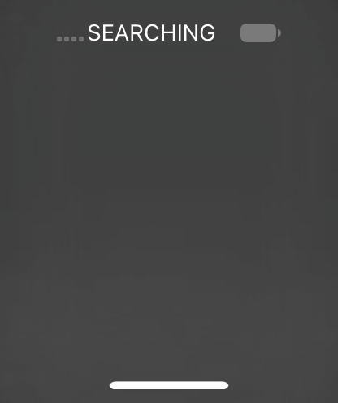

# Fonts and signed capture permissions (V64, 24A437)

V63's live inventory contained only Helvetica.ttc, LastResort.otf, and
SFUI.ttf under /System/Library/Fonts/Core. CoreUI was absent.
[Guest inventory](font-inventory-v63.txt). The stopped image now contains all
265 files (397411642 logical bytes) from the matching system font tree,
with every installed file SHA-256 checked against its original.
[Full manifest and signed probe identity](fonts-capture-image-v64.json).

The capture probe was rebuilt from unchanged source and signed with
[its dedicated permissions](../display-capture-entitlements.plist).
Strict signature verification passed. Its CDHash was added to the v1 trust
cache (4402 → 4403 entries), preserving every previous entry. No Apple font
or executable bytes are committed to the repository.

V64 cache slide: 0x1a864000. UserManager PID 38 base 0x1021f4000.
Mobile NSString 0x79ad00c500 was checked against its full UUID. The temporary
kernel inspection byte at 0xfffffe0017088db4 was restored and read back zero.
[Derived startup commands](fonts-startup-v64.lldb).
An initial installd submit used the wrong basename and returned ENOENT;
submitting com.apple.mobile.installd.probe.plist corrected it. System app
registration then returned true.

Launchd base 0x100ba4000 was derived from LR 0x100bbe21c and verified by
Mach-O magic. The original extensionkitservice path had helper result 1,
mode 0755, UID/GID 99; one stat UID override at 0x7b328a8bb0 enabled launch.
That breakpoint was then removed. SpringBoard PID 59, backboard PID 52,
CommCenter PID 65 remain running.

## Signed permissions verified

The first signed probe obtained stateControl without intervention, requested
wake, but sampled state 0 and captured transparent black. A later request
reported state 1 before and after wake. This is consistent with the initial
capture racing an asynchronous display transition; the short run-loop wait
is not a completion guarantee.

On the later capture, an observation-only breakpoint at runtime 0x19ee5ab40
(unslid 0x1845f6b40) read w0=0: the global filter was already granted by the
signed entitlement. No register was changed. The observer was removed and
the request completed with 206336 nonblack/opaque pixels, all 825344 bytes,
and exit zero. [First request](fonts-wake-capture-v64.txt),
[successful follow-up](fonts-wake-observed-v64.txt).
No display-state or capture permission override was used in V64. Existing
persona, credential, and backlight guest diagnostics are still required.

A setter observer was installed too late to see the transition (the follow-up
already saw state 1). It was removed unused. Two initially miscalculated
observer addresses were removed before any hit; addresses above include the
correct arithmetic. The launch-probe list LABEL syntax was also rejected;
plain list subsequently confirmed the live job PIDs.

## Image verification

The first UART observation window expired during export. A passive collector
resumed the same transfer; the configured QEMU serial log retained the full
stream. The decoder recovered exactly 825344 bytes and recounted 206336
nonblack/opaque pixels, agreeing with the guest.
[Image hash and counts](display-fonts-v64.json).

The frame shows a shaded gray background, SEARCHING, a battery icon, and a
home indicator. The earlier missing-glyph boxes are absent, but the central
text is also absent. Therefore this comparison does **not** establish that
the same text now renders correctly. Fonts are restored and byte-verified;
visual font correctness remains unresolved. No home-screen or touch-input
success is claimed.

The reusable decoder also reproduced the V63 capture's exact raw SHA-256
and pixel counts from its original UART transcript. It preserves alpha in
PNG output, unlike the earlier one-off RGB export.
