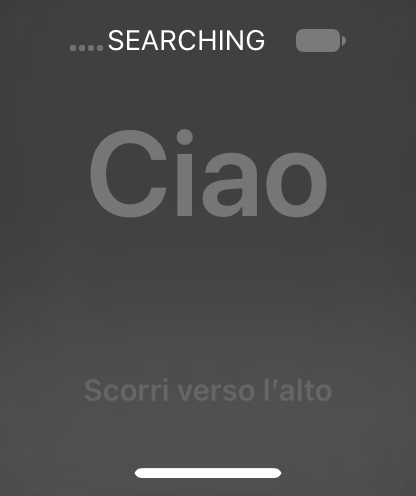

# Guest HID event-dispatch experiment (V65, 24A437)

V64 bootstrap lookups succeeded for com.apple.iohideventsystem and
com.apple.backboard.hid.services. [Lookup transcript](hid-service-lookup-v64.txt).

The input probe starts with a bounded consumer Menu/Home key pair. It lists
HID services, registers a monitor callback, stamps its own sender ID, and
reports matching callbacks separately from dispatch returning. Touch/swipe
is not implemented or claimed yet.

Primary API guidance: Apple's
[IOHIDEventSystemMonitor](https://github.com/apple-oss-distributions/IOHIDFamily/blob/777ccd9698845aadf711e32d843c8c9b777431d9/tools/IOHIDEventSystemMonitor.c)
and its
[entitlements](https://github.com/apple-oss-distributions/IOHIDFamily/blob/777ccd9698845aadf711e32d843c8c9b777431d9/tools/IOHIDEventSystemMonitor-Entitlements.plist).
Only event-monitor and event-dispatch are requested by this probe.

Exact 24A437 IOKit symbols (unslid):

- IOHIDEventSystemClientCreateWithType: 0x18f07f3cc
- IOHIDEventCreateKeyboardEvent: 0x18f0cb0e4
- IOHIDEventSystemClientDispatchEvent: 0x18f0d30ac
- Server MIG dispatch handler: 0x18f0fbde8
- Server dispatch implementation: 0x18f10f270
- Permission branch: 0x18f10f2d8 checks connection entitlement bit 3.
- Accepted event dispatch call: 0x18f10f318.

The server implementation returns zero even on several discard paths.
Neither a client return nor a successful MIG return proves delivered input;
observe the accepted-event path, monitor callback, and resulting UI separately.

The display packer compresses the existing 416x496 BGRA capture using guest
libz. The host decoder's --zlib path preserves exactly the original bytes.
A local round trip of the real V64 image preserved its SHA-256 and all pixel
counts (825344 → 12290 bytes). Truncated, trailing, and oversized compressed
streams were rejected. Guest runtime validation remains pending.

[Installed hashes and trust-cache additions](hid-image-v65.json).

## Startup derivation

Cache slide 0x1bfc0000, UserManager PID 38 base 0x10010c000.
Borrowed mobile NSString 0x7d7ec0c4b0 was checked against the full mobile UUID;
the other dictionary key contained the all-F system UUID. The inspection
byte at 0xfffffe0017088db4 was restored and read back zero.
[Startup snapshot](hid-startup-v65.lldb). These addresses are boot-specific.

Launchd base 0x100ce8000 was derived from LR 0x100d0221c and verified by
Mach-O magic. The original extensionkitservice path passed its framework
check (result 1, mode 0755), with stat UID/GID 99. The one-time stat UID
write at 0x78109302f0 enabled launch; that observer was removed.
System app rebuild returned true.

## HID delivery verified

The inventory invocation created type 1 (`Monitor`) but CopyServices returned
NULL, reported as -1. No service inventory success is inferred from that.

The --home invocation (PID 71) sent Consumer page 12 / Menu usage 64 down/up
with sender ID 0xa190000000006500. Both hit the server permission branch at
runtime 0x1ab0cf2d8 with mask 0x0a (including dispatch bit 3). Neither mask was
modified. Both reached the accepted-event call at 0x1ab0cf318, with their
sender IDs verified in the server event objects at offset +0x10.
Both observation breakpoints were then deleted.

The client's asynchronous monitor received exactly two matching callbacks:
TYPE=3 PAGE=12 USAGE=64, DOWN=1 then DOWN=0. Probe exit was zero.
[Complete input transcript](hid-home-v65.txt). This verifies dispatch through
the HID server and monitor delivery, not SpringBoard's interpretation or touch.

The display packer succeeded inside the guest. The decoded baseline matched
the guest's 206336 opaque pixels, zero nonblack pixels, and 825344 bytes.
[Baseline transcript](hid-baseline-capture-v65.txt),
[decoded identity](hid-before-v65.json). The LCD reported on. This baseline
differs from the prior boot's shaded UI, so a later visual change alone cannot
be attributed to the injected key.

## Visible setup greeting

The post-input capture shows a legible Italian setup greeting, `Ciao`, and
`Scorri verso l’alto` (swipe up), plus status and home indicators. This is
stronger visual evidence than V64's empty central region: actual greeting
text renders with the restored font tree. It does not isolate which font
file fixed which earlier missing glyph, or prove the Home event caused the
change, because the greeting is animated and the initial baseline was early.

[Capture transcript](hid-after-capture-v65.txt),
[decoded image identity](hid-after-v65.json). All 206336 pixels were opaque
and nonblack; the raw 825344-byte frame compressed to 19347 bytes in the guest.
The host SHA-256 is 8f0ac0fab2cdc1c07a662375ab9ff92b35a77e319a8e5b3fd4ee76407a95d552.
SpringBoard PID 58, backboard PID 51, and CommCenter PID 64 remained live.

Next: implement a bounded digitizer swipe, verify its server delivery, and
look for a transition beyond the welcome screen. No successful touch,
setup completion, or usable interactive emulator is claimed yet.
