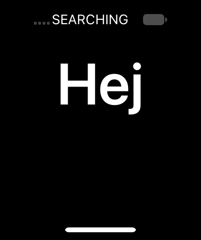

# Digitizer swipe experiment (V66, 24A437)

Extends the verified HID monitor/dispatch probe with --swipe. It preallocates
14 parent-hand/finger pairs, moves normalized (0.5,0.96) to (0.5,0.20) in
12 steps, then releases. Each dispatch updates both timestamps. A 40 ms
sleep plus run-loop servicing paces events; actual delivery timing remains
to be measured. Sender ID remains the diagnostic 0xa190000000006500.

The exact-build HID.framework accessor at unslid 0x267f92a7c sets
IsDisplayIntegrated via field 0xb0019. Accessors at 0x267f92984,
0x267f92b24 and 0x267f92b9c identify mask, range, and touch fields as
0xb0007, 0xb0008 and 0xb0009. The finger constructor wrapper at
0x18f0a15ac rearranges arguments and supplies transducer type 2 to the full
constructor at 0x18f0a16ec. Full-constructor stack loads consume 32-bit
touch/options values, so probe declarations use unsigned integer arguments.
The experiment uses parent transducer 3 and masks 3 on down/up, 4 on motion;
UI interpretation still requires runtime validation.

Both source compilation with warnings-as-errors and strict signature
verification passed. [Installed identity](swipe-image-v66.json).
Only the guest probe and additive trust-cache entry changed for this boot.
The source prints received digitizer mask/touch/display integration,
coordinates, child count, and the child finger's coordinates/touch state.

## Startup

Cache slide 0xd9b0000; UserManager PID 38 base 0x104f60000.
Mobile NSString 0x7c26c283c0 was checked against its complete UUID; the other
key was the all-F system UUID. Inspection byte 0xfffffe0017088db4 was restored
and read back zero. [Startup snapshot](swipe-startup-v66.lldb).

Runtime swipe results pending.

Launchd base 0x102d0c000 was derived from LR 0x102d2621c and verified by
Mach-O magic. The original extensionkitservice path passed the helper with
result 1 and mode 0755; stat UID/GID were 99. A single stat UID write at
0x73df500570 enabled launch and its observer was removed. System app rebuild
returned true. The first wake sampled off and left the capture's prefill
unchanged; it is not evidence of display contents.

## Digitizer stream verified

The repeated wake/capture reported on and showed a legible `Hallo` greeting
with its German swipe-up instruction. [Pre-swipe frame](swipe-before-v66.png).
The initial --swipe test ran without input-observation breakpoints.

All 14 frames returned through the HID monitor: masks 3 for down/release and
4 for motion, touch 1 until the final touch 0, display-integrated 1, X=0.500,
Y moving from 0.960 to 0.200, and exactly one child finger per event. Child
coordinates and touch state matched every frame. Source process exit zero.
[Input transcript](swipe-input-v66.txt), [field checks](swipe-validation-v66.json).
This proves digitizer serialization and HID monitor delivery, not UI routing.

## Touchscreen routing failure localized

The first post-swipe frame was opaque black and reported LCD off. It cannot
prove a successful gesture. A second test ran wake → swipe → capture in one
shell command while a read-only observer watched BackBoard's direct-touch
processor. Its address was unslid 0x22ac90e88 + slide = 0x238640e88, immediately
after service resolution and retain. The selector stub at 0x23002edc0 refers
to string 0x1f5d41600; guest memory confirmed the selector was exactly
`_determineServiceForEvent:sender:fromTouchPad:`.

The observer was conditional on event sender 0xa190000000006500. It hit
**14 times**, each with x0=0 (no service), and was removed afterward. No
register/result override was used. The processor's following cbz selects
its missing-service path. The monitor still returned all 14 events.
This establishes that synthetic sender injection reaches BackBoard but is
not associated with a routable touchscreen service.

[Repeat transcript](swipe-routing-v66.txt),
[repeat image identity](swipe-routing-v66.json).

The image still shows the rotating welcome greeting, now `Hej`. Advancing
past the welcome screen is not achieved. The next experiment should register
a virtual touchscreen and dispatch events using its assigned service ID.
[Apple's HIDVirtualEventService implementation](https://github.com/apple-oss-distributions/IOHIDFamily/blob/777ccd9698845aadf711e32d843c8c9b777431d9/HID/HIDVirtualEventService.m) provides a supported-in-library
path through IOHIDVirtualServiceClientCreateWithCallbacks and
IOHIDVirtualServiceClientDispatchEvent; runtime capability is still untested.

## Registry-ID source correction

Inspection of Apple's HIDVirtualEventService source also revealed that
IOHIDServiceClientGetRegistryID returns a borrowed CFNumber, not uint64_t.
The source now converts that number with CFNumberGetValue; the corrected
source compiles with warnings-as-errors, but this enumeration-only fix is
**not installed in V66**. V65/V66 CopyServices returned NULL, so the incorrect
old conversion never executed in the recorded runs. Installed V66 identity
remains exactly the manifest above; the next build must include this fix.
