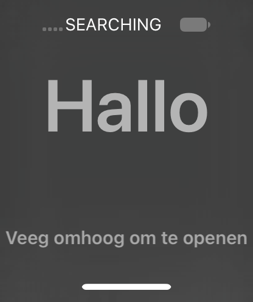

# Display-associated virtual touch verified (V69, 24A437)

The V69 source fix is installed and works without the V68 display-ID or
geometry debugger overrides. The probe discovers the LCD's current uniqueId,
serves it as `displayUUID`, and BackBoard converts all observed touch
coordinates correctly. The welcome screen still does not advance.

[Installed binary and trust-cache manifest](virtual-touch-display-image-v69.json).
The binary and source hashes were checked against the prior build manifest
before installation. The stopped guest image received the verified binary;
trust cache v1 gained one entry, 4408 → 4409, preserving existing entries.
The image was unmounted before boot.

## Startup context

Cache slide 0x1e51c000; UserManager PID 38 base 0x102ecc000.
Borrowed mobile NSString 0x7897010500 was checked against the full mobile
UUID; the other dictionary key was the all-F system UUID. The temporary
inspection byte 0xfffffe0017088db4 was restored and read back zero before
support-service startup. [Boot-specific commands](virtual-touch-startup-v69.lldb).
System app registry rebuild returned 1.

Launchd base 0x100af4000 was derived from LR 0x100b0e21c and verified by
Mach-O magic. The original extensionkitservice path passed its helper with
result 1, mode 0755, and UID/GID 99. A one-time stat UID write at
0x76e15542f0 allowed launch; that observer was removed. SpringBoard PID 58,
CommCenter PID 64. Existing persona, display, credential, and backlight
bootstrap workarounds still apply. This is not a debugger-free guest boot.

## Probe fix works normally

The [first run](virtual-touch-clean-v69.txt) had no input breakpoints or
input overrides. It sent Home down/up, requested wake, then registered the
updated touchscreen and sent its swipe. The first wake still reported off;
the capture after the gesture reported on but showed an early frame with
only the home indicator. It is not evidence of successful navigation.

The discovered display identifier was:

```
C5392DFA-E7E9-4753-8249-B0A42371E934
```

It differs from V68, confirming the source did not hard-code the old UUID.
Every requested displayUUID property was supplied (FOUND=1). BackBoard also
set GraphicsOrientation on the service. Enumeration notification 10 arrived,
all 14 virtual dispatches returned 1, 14 matching monitor callbacks arrived,
and the probe exited zero.

## Read-only geometry verification

A repeat gesture used three read-only observers, all addresses plus the
new cache slide:

| Stage | Unslid address | Hits |
| --- | --- | ---: |
| geometry after lookup | 0x22ac97524 | 28 |
| converted coordinate output | 0x22ac975f8 | 28 |
| `_postEvent:attributes:toDestination:initialTimestamp:` | 0x22ac9c650 | 2 |

All geometry samples were width 416, height 496, scale 1. All coordinates
were finite. Each frame was converted twice; X remained 208 and Y was
476,445,413,382,351,319,288,256,225,193,162,131,99,99. The two posting-method
hits had non-NULL destination arguments. No input registers or geometry
were changed. All three observers were removed after their hit counts were
read back.

[Debugger observations](virtual-touch-geometry-debug-v69.txt),
[gesture transcript](virtual-touch-geometry-v69.txt),
[machine-checked values and outcomes](virtual-touch-validation-v69.json).

The initial serial image export was rejected by the zlib decoder: an
interleaved log fragment (`imes`) was misclassified as base64 before the
actual compressed stream. The unchanged packed file was exported again;
[that complete export](virtual-touch-geometry-export-v69.txt) passed zlib
and exact-size validation. No frame data was guessed or repaired.



This shows Hallo and the Dutch swipe-up instruction. A subsequent gesture
with all input observers removed again produced 14 successful dispatches,
14 monitor callbacks, and exit zero. Its captured screen still showed the
welcome greeting, now in Arabic. [Settled run](virtual-touch-settled-v69.txt),
[capture identity](virtual-touch-settled-v69.json).
Touch geometry and the observed posting path are verified; application
receipt and welcome-screen navigation are not.

## Missing setup components are the next integration target

Guest inspection confirmed `/Applications/Setup.app` is absent. The exact
firmware launch plist identifies the daemon as
`/System/Library/PrivateFrameworks/SetupAssistant.framework/budd`, also
absent, along with a submitted-job plist for it. (An earlier speculative
`/usr/libexec/budd` check was not the correct daemon path.)
[Exact-path checks](setup-components-v69.txt).
SpringBoard logs failed lookups for `com.apple.purplebuddy.budd.xpc`.

The original 24A437 system volume contains:

- Setup.app: 1,137 regular files, 84,349,026 logical bytes.
- SetupAssistant.framework resources and budd: 5 regular files,
  546,504 logical bytes; framework code is in the shared cache.
- `com.apple.purplebuddy.budd.plist`, declaring the original daemon path,
  mobile user, and nine Mach service names.

Both main executables already have their hashes in the current trust cache:
Setup d7116316390c8c064ddd37c1ba1d87973576944a;
budd d6a5763ffc917b67c718aa2f957689f4e46ab243.
They have not been copied or launched in V69. These missing components are
necessary integration work, but their absence is not yet proven to be the
sole reason the swipe does not advance. Check actual free space offline
before adding them; `/bin/df` is absent in this guest, and logical source
size is much larger than the compressed source-volume allocation.
