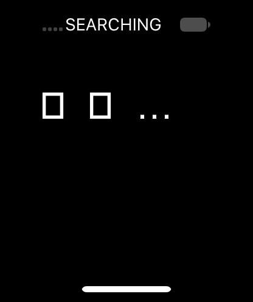

# LCD state and wake comparison (V63, 24A437)

Booted the [state-reporting capture probe](display-state-probe-v63.json).
Cache slide 0x110d0000; UserManager PID 38 base 0x100cdc000; verified mobile
NSString 0x7dc9010820. Developer inspection byte was restored/read back zero.
[Startup snapshot](wake-startup-v63.lldb). System app rebuild returned true.

Launchd base 0x104c9c000 was derived from LR 0x104cb621c and verified by Mach-O
magic. The original extension bundle path passed its framework check with
mode 0755 and UID/GID 99:99. One stat UID write at 0x792f4c0570 allowed launch;
the observation breakpoint was removed. SpringBoard PID 58, backboard PID 51.
No secure-indicator lookup override is installed.

## Capture permission correction

The earlier V60/V62 black captures were caller-only: the probe lacked
`com.apple.QuartzCore.global-capture`. They do not establish that SpringBoard
was black. QuartzCore's caller-filter helper at unslid 0x1845abab0 returns
the requesting PID unless its audit-token entitlement mask has bit 0.
At render_display +0x80 (0x1845f6b40), PID 69 returned filter 69. A single
register override to zero selected the existing global-capture path, leaving
secure-capture permissions unchanged. The completed capture had 206336 opaque
pixels, zero colored pixels. [Transcript](capture-global-diagnostic-v63.txt).

## Display-state permission and wake

Baseline stateControl was nil, and --wake exited 1 without attempting a
transition. The state-control IPC transport succeeded but returned private
error 0xfb294001. This is the rejection emitted by __XGetDisplayStateShmem
when entitlement bit 16 (`com.apple.QuartzCore.display-state`) is absent.
The setter checks the same bit; both also reject bits 7 or 17.

For one PID 70 request, the debugger observed mask zero and caller PID 70
in the audit token, then changed w0 to 0x10000 at each final bit-16 test:

- Get: unslid 0x18456caa4, runtime 0x19563caa4; display ID 1.
- Set: unslid 0x1845c57b4, runtime 0x1956957b4; requested state 1.
- Capture: unslid 0x1845f6b40, runtime 0x1956c6b40; filter 70 changed to 0.

Each diagnostic breakpoint was deleted immediately after its single use.
The guest reported stateControl present, state 0 (off) before the request,
and state 1 (on) afterward. Capture succeeded with 206336 changed/opaque
pixels and **6118 colored pixels**, writing all 825344 BGRA bytes; exit zero.
[Complete wake/capture transcript](wake-authorized-diagnostic-v63.txt).
This proves a reported display-state transition and nonblack rendered content,
not interactive input or a usable graphical emulator.

The installed V63 binary still has only its IOSurface entitlement. These
results used scoped debugger diagnostics, not a successfully re-signed probe.
A dedicated entitlement plist records the two required permissions for the
next signed build; its runtime validation remains outstanding.

## Retrieved image

The full UART base64 transfer decoded to exactly 825344 bytes. Host recounts
match the probe: 6118 nonblack pixels and 206336 opaque pixels.
[Image identity and counts](display-wake-v63.json).

Visual inspection shows SEARCHING, a battery icon, a home indicator, and
missing-glyph boxes in the main text. This is recognizable system UI, but
not a complete home screen. Fonts/resources and input remain open work.
